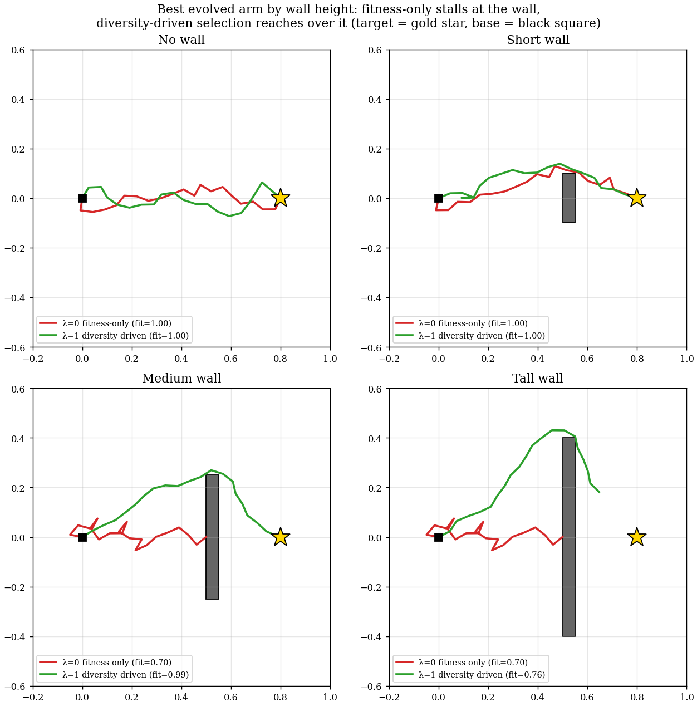

# MMR-Elites: Balancing fitness and diversity in evolutionary algorithms

[](https://www.python.org/downloads/)
[](https://opensource.org/licenses/MIT)

Many search problems want not the single best solution but a set of solutions that are each good *and* different from one another. Picking by quality alone gives you redundancy — the top items tend to look alike. MMR-Elites picks a high-quality, diverse subset using **Maximum Marginal Relevance (MMR)**, an idea borrowed from information retrieval, where each pick maximizes

```
score(x) = (1 − λ) · fitness(x)  +  λ · distance(x, already-picked)
```

`λ` dials between pure quality (`λ=0`, top-K by fitness) and pure diversity (`λ=1`, maximize spread). The name is a nod to [MAP-Elites](https://arxiv.org/abs/1504.04909), the quality-diversity (QD) algorithm this builds on; MMR-Elites replaces its fixed grid with grid-free greedy selection, so it keeps a fixed-size archive and scales to high-dimensional behavior spaces where a grid would blow up (3²⁰ ≈ 3.5 billion cells for a 20-joint arm).

## Two ways to use it

**1. As a one-shot diverse selector.** Pick the *k* best-but-distinct items from a pool. For example, selecting 10 of 50 LLM-generated pieces of fundraising advice (quality scored by another LLM, similarity by an embedding model):

| Method | Mean Quality | Diversity (cosine) |
|--------|:-----------:|:-----------------:|
| Naive Top-K | 0.620 | 0.653 |
| **MMR-Elites** | 0.608 | **0.716** |

Both pick the same #1 item (greedy MMR always takes the best first); MMR then trades 2% mean quality for 10% more diversity, swapping a near-duplicate tip for a genuinely different one.

```bash
pip install -e ".[examples]"
python examples/llm_response_selection.py   # pre-generated data, no API key
```

**2. As the selection step of an evolutionary algorithm.** Each generation, keep K survivors from the archive plus new offspring. Here diversity is not just a nice output property — it makes the *optimization itself* work better, which is the more surprising claim and the one worth dwelling on.

## Why diversity helps even when you only care about the best solution

Judging a selector by single-generation quality is misleading: a fitness-only selector always wins *that* comparison. The payoff from spending part of the budget on diversity is long-run. Diverse survivors are **stepping stones** — on a *deceptive* problem (where the route to the global optimum dips through low-fitness regions), greedy fitness selection climbs straight into a local optimum and stays there, while a selector that keeps behaviorally distinct individuals preserves the lineages that eventually get around it.

This is exactly the finding of Lehman & Stanley's *[Abandoning Objectives: Evolution Through the Search for Novelty Alone](https://doi.org/10.1162/EVCO_a_00025)* (2011): when the objective is a poor compass, searching for novelty reaches the objective faster than aiming at it. MMR-Elites turns that all-or-nothing choice into a continuous `λ` knob.

**A clean demonstration.** A 20-joint arm must reach a target hidden behind a wall; touching the wall scores 0.70, getting around it scores ~1.0 (2-D end-effector position as the behavior descriptor, the classic MAP-Elites arm setup but with an added obstacle to make it deceptive). `λ=0` is ordinary fitness-only evolution with the identical mutation operator and budget, so any improvement at higher `λ` comes from diversity in selection *alone*. After 2,000 generations (5 seeds):

| Selection | Final best fitness | Seeds that got around the wall |
|---|:---:|:---:|
| `λ=0` (pure fitness) | 0.700 ± 0.000 | 0 / 5 |
| `λ=0.5` (balanced) | 0.700 ± 0.000 | 0 / 5 |
| **`λ=1` (diversity-driven)** | **0.976 ± 0.010** | **5 / 5** |
| MAP-Elites (32×32 grid) | 0.920 ± 0.048 | 3 / 5 |

Every fitness-dominated run stalls at exactly 0.700 — pinned against the wall — on every seed. Diversity-driven selection solves it every time, and faster than MAP-Elites. (`λ=1` here is novelty-driven but still retains the single best-so-far individual, so quality never regresses.)



The best evolved arm at each wall height makes this physical: the fitness-only arm (red) jams flat against the wall, while the diversity-driven arm (green) arcs over it to reach the target. For the *tall* wall, even the diversity-driven arm only gets over the top — the 20 links aren't long enough to curl back down to the target on the far side, which is why no setting fully solves that case. Regenerate with `python experiments/plot_evolved_solutions.py`.

**The best `λ` depends on how deceptive the task is.** Sweeping `λ` against wall height shows `λ*` (the optimum) sliding from the interior toward 1 as deception grows — and on a non-deceptive version (no wall) a middling `λ` that keeps some fitness pressure is best. Reproduce with `experiments/lambda_deception_sweep.py`.

| Wall height (deception) | λ=0 | λ=0.5 | λ=0.8 | λ=0.9 | λ=0.95 | λ=1 | best λ |
|---|:---:|:---:|:---:|:---:|:---:|:---:|:---:|
| none (not deceptive) | 1.00 | 1.00 | 1.00 | 1.00 | 1.00 | 0.999 | ≤0.95 |
| short wall | 1.00 | 1.00 | 1.00 | 1.00 | 1.00 | 0.998 | ≤0.95 |
| medium wall | 0.700 | 0.700 | 0.953 | 0.962 | 0.959 | **0.976** | **1.0** |
| tall wall | 0.700 | 0.700 | 0.700 | 0.702 | 0.746 | **0.757** | **1.0** |

Final best fitness, mean over 5 seeds. Reading down each column: the more deceptive the task, the higher the `λ` you need. Reading the top rows: when the task is *not* deceptive, going all the way to `λ=1` is slightly counterproductive — a little fitness pressure helps. The objective is worth following when it points the right way, and worth ignoring when it doesn't.

## How the selection works, and why it's fast

Naive greedy MMR costs O(NK²) distance computations. The Rust backend computes the **identical** selection far faster with a lazy priority queue: because each candidate's distance to the chosen set can only shrink as the set grows, cached scores stay valid as upper bounds, so most candidates are accepted without recomputation (worst case O(N·K); roughly an order of magnitude faster than a vectorized NumPy greedy in practice). For high-dimensional or embedding behavior spaces, an optional saturating distance `1 − exp(−‖b₁−b₂‖/σ)` bounds the diversity term so it can't dominate fitness.

## QD benchmark (20-joint arm, 2-D behavior space, 10 seeds)

| Algorithm | QD-Score@K\* | Uniformity (CV↓) | Archive Size |
|-----------|:-----------:|:----------------:|:------------:|
| **MMR-Elites** | 663.7 ± 2.1 | **0.059 ± 0.002** | 1,000 |
| MAP-Elites | 675.0 ± 5.0 | 0.455 ± 0.010 | 84,035 |
| CVT-MAP-Elites | 634.9 ± 4.7 | 0.467 ± 0.029 | 913 |
| Random (top-K) | 633.2 ± 0.9 | 0.068 ± 0.002 | 1,000 |

\*Top-K=1,000 fitness sum, so methods are compared at the same budget (MAP-Elites' raw whole-archive score is 31,057 across 84k cells). Lower uniformity CV = more even coverage. MMR-Elites matches the others on quality-at-budget while covering behavior space ~8× more evenly with a 1,000-item archive instead of 84,000. Regenerate with `mmr-elites benchmark --full`.

## Install & run

```bash
git clone https://github.com/aaholmes/mmr-elites.git && cd mmr-elites
pip install maturin && maturin develop --release   # build the Rust backend
pip install -e .

mmr-elites run --task arm --generations 500 --seed 42   # single run
mmr-elites benchmark --quick                            # compare all algorithms
```

```python
from mmr_elites.tasks.arm import ArmTask
from mmr_elites.algorithms import run_mmr_elites

task = ArmTask(n_dof=20, use_highdim_descriptor=True)
result = run_mmr_elites(task, archive_size=1000, generations=2000,
                        lambda_val=0.5, seed=42)   # returns a dict
print(result["final_metrics"]["max_fitness"])
```

## Citation & credits

```bibtex
@software{holmes2026mmrelites,
  title={MMR-Elites: Quality-Diversity Optimization via Maximum Marginal Relevance},
  author={Holmes, Adam A.},
  year={2026},
  url={https://github.com/aaholmes/mmr-elites}
}
```

MIT licensed (see [LICENSE](LICENSE)). Builds on MMR (Carbonell & Goldstein, 1998), MAP-Elites (Mouret & Clune, 2015), and novelty search (Lehman & Stanley, 2011); benchmark tasks adapted from [pyribs](https://pyribs.org). MAP-Elites came to the author's attention via Risi et al.'s [*Neuroevolution*](https://neuroevolutionbook.com/) (MIT Press, 2025).
